# Printer Driver Unification - Critical Update Needed

**Created:** January 5, 2026  
**Status:** ⚠️ **ACTION REQUIRED**  
**Priority:** 🔴 **HIGH - Affects all printing workflows**

---

## Problem Identified

There are **TWO SEPARATE** printing systems in the codebase that are NOT synchronized:

### System A: **Updated Renderers** (✅ HAS BOPP Design + labelId)
Located in: `src/utils/`
- ✅ `zebraPrinter.ts` - Zebra ZPL with BOPP design, labelId in QR
- ✅ `labelRenderers/pdfRenderer.ts` - PDF with BOPP design, labelId in QR
- ✅ `labelRenderers/genericRenderer.ts` - Generic with BOPP design, labelId in QR

**Features:**
- Minimalistic black & white BOPP design
- USE BY section with reverse print (black background, white text)
- Condition field less visible (gray, smaller)
- QR code includes **labelId** for lifecycle tracking
- Saves to database first, then generates label with labelId
- Consistent hierarchy across all formats

### System B: **Old Printer Drivers** (❌ OLD Design, NO labelId)
Located in: `src/lib/printers/`
- ❌ `ZebraPrinter.ts` - Old ZPL generation
- ❌ `PDFPrinter.ts` - Old PDF generation  
- ❌ `GenericPrinter.ts` - Old HTML generation

**Issues:**
- Uses OLD label design (not BOPP)
- QR codes do NOT include labelId
- Does NOT use updated renderers
- Inconsistent with current requirements
- Missing lifecycle tracking capability

---

## Impact Analysis

### Current Workflow Usage:

#### **1. Label Form** (`LabelForm.tsx`)
**Uses:** `usePrinter` hook → Old printer drivers (System B) ❌

```typescript
const { print } = usePrinter();
await print(labelData); // ← Uses OLD printers, NO labelId in QR!
```

#### **2. Print Queue** (`PrintQueue.tsx`)  
**Uses:** Direct import of `printLabel` from `zebraPrinter.ts` (System A) ✅

```typescript
import { printLabel } from "@/utils/zebraPrinter";
await printLabel(data); // ← Uses NEW printer with labelId ✅
```

#### **3. Label Preview** (`LabelPreviewCanvas.tsx`)
**Uses:** Updated renderers (System A) ✅

```typescript
import { renderGenericLabel, renderPdfLabel, renderZebraLabel } from '@/utils/labelRenderers';
await renderGenericLabel(ctx, labelData, width, height); // ← Correct ✅
```

---

## The Problem in Detail

### Scenario: User Prints from Label Form

1. User fills out label form
2. Clicks "Print" button
3. **Label saves to database** → gets `labelId`
4. Calls `print()` from `usePrinter` hook
5. **usePrinter uses OLD printer drivers** → generates label WITHOUT labelId
6. **Result:** QR code missing labelId, can't track lifecycle ❌

### What Should Happen:

1. User fills out label form
2. Clicks "Print" button
3. **Label saves to database** → gets `labelId`
4. Calls **updated printLabel()** function
5. **Generates ZPL/PDF/Generic WITH labelId in QR code**
6. **Result:** QR code contains labelId, full lifecycle tracking ✅

---

## Solution Options

### **Option 1: Update Old Printer Drivers (Recommended)**

**Action:** Refactor `ZebraPrinter.ts`, `PDFPrinter.ts`, and `GenericPrinter.ts` to use our updated renderers

**Pros:**
- Maintains existing architecture
- Preserves `usePrinter` hook pattern
- Minimal changes to components

**Cons:**
- More code to maintain (two systems)
- Potential for future drift

**Implementation:**

```typescript
// src/lib/printers/ZebraPrinter.ts
import { generateZPL, saveLabelToDatabase } from '@/utils/zebraPrinter';

async print(labelData: any): Promise<boolean> {
  try {
    // 1. Save to database to get labelId
    const labelId = await saveLabelToDatabase({...labelData});
    
    // 2. Add labelId to data
    const dataWithLabelId = { ...labelData, labelId };
    
    // 3. Use updated ZPL generator (has BOPP design + labelId)
    const zpl = generateZPL(dataWithLabelId);
    
    // 4. Send to printer
    await this.sendToPrinter(zpl);
    
    return true;
  } catch (error) {
    console.error('Print error:', error);
    return false;
  }
}
```

```typescript
// src/lib/printers/PDFPrinter.ts
import { renderPdfLabel } from '@/utils/labelRenderers/pdfRenderer';
import { saveLabelToDatabase } from '@/utils/zebraPrinter';

async print(labelData: any): Promise<boolean> {
  try {
    // 1. Save to database to get labelId
    const labelId = await saveLabelToDatabase({...labelData});
    
    // 2. Add labelId to data
    const dataWithLabelId = { ...labelData, labelId };
    
    // 3. Create canvas and render with updated renderer (BOPP + labelId)
    const canvas = document.createElement('canvas');
    const ctx = canvas.getContext('2d');
    await renderPdfLabel(ctx, dataWithLabelId, 600, 848);
    
    // 4. Convert to PDF and download
    const pdf = await this.canvasToPDF(canvas);
    pdf.save(`label_${labelData.productName}.pdf`);
    
    return true;
  } catch (error) {
    console.error('PDF print error:', error);
    return false;
  }
}
```

```typescript
// src/lib/printers/GenericPrinter.ts
import { renderGenericLabel } from '@/utils/labelRenderers/genericRenderer';
import { saveLabelToDatabase } from '@/utils/zebraPrinter';

async print(labelData: any): Promise<boolean> {
  try {
    // 1. Save to database to get labelId
    const labelId = await saveLabelToDatabase({...labelData});
    
    // 2. Add labelId to data
    const dataWithLabelId = { ...labelData, labelId };
    
    // 3. Create canvas and render with updated renderer (BOPP + labelId)
    const canvas = document.createElement('canvas');
    const ctx = canvas.getContext('2d');
    await renderGenericLabel(ctx, dataWithLabelId, 480, 480);
    
    // 4. Open print dialog with canvas content
    this.printCanvas(canvas);
    
    return true;
  } catch (error) {
    console.error('Generic print error:', error);
    return false;
  }
}
```

---

### **Option 2: Remove Old Drivers, Use Direct Imports (Simpler)**

**Action:** Update components to directly import from `zebraPrinter.ts` and `labelRenderers/`

**Pros:**
- Single source of truth
- No code duplication
- Easier to maintain

**Cons:**
- Breaks existing `usePrinter` hook pattern
- More component changes required

**Implementation:**

```typescript
// src/components/labels/LabelForm.tsx

// REMOVE:
// import { usePrinter } from '@/hooks/usePrinter';
// const { print } = usePrinter();

// ADD:
import { printLabel } from '@/utils/zebraPrinter';
import { renderPdfLabel } from '@/utils/labelRenderers/pdfRenderer';
import { renderGenericLabel } from '@/utils/labelRenderers/genericRenderer';

const handlePrint = async () => {
  // Save to database first
  const labelId = await saveLabelToDatabase(labelData);
  
  // Add labelId to data
  const dataWithLabelId = { ...labelData, labelId };
  
  // Choose renderer based on selected printer type
  switch (printerType) {
    case 'zebra':
      await printLabel(dataWithLabelId);
      break;
    case 'pdf':
      await exportToPDF(dataWithLabelId);
      break;
    case 'generic':
      await printToGeneric(dataWithLabelId);
      break;
  }
};
```

---

## Recommended Action Plan

### ✅ **Phase 1: Immediate Fix (Option 1)**

**Priority:** 🔴 Critical - Do this NOW

1. **Update ZebraPrinter.ts**
   - Import `generateZPL` and `saveLabelToDatabase` from `@/utils/zebraPrinter`
   - Modify `print()` and `printBatch()` to:
     - Save to database first
     - Get labelId
     - Use updated ZPL generator
   - Remove old ZPL generation code

2. **Update PDFPrinter.ts**
   - Import `renderPdfLabel` from `@/utils/labelRenderers/pdfRenderer`
   - Import `saveLabelToDatabase` from `@/utils/zebraPrinter`
   - Modify `print()` and `printBatch()` to:
     - Save to database first
     - Get labelId
     - Use canvas renderer
     - Convert canvas to PDF

3. **Update GenericPrinter.ts**
   - Import `renderGenericLabel` from `@/utils/labelRenderers/genericRenderer`
   - Import `saveLabelToDatabase` from `@/utils/zebraPrinter`
   - Modify `print()` and `printBatch()` to:
     - Save to database first
     - Get labelId
     - Use canvas renderer
     - Print canvas content

### ✅ **Phase 2: Testing**

1. **Test Label Form**
   - Print with Zebra printer
   - Print with PDF export
   - Print with generic printer
   - **Verify:** QR code contains labelId

2. **Test Print Queue**
   - Already uses correct system
   - Verify still works after changes

3. **Test Quick Print**
   - Ensure follows same pattern
   - **Verify:** QR code contains labelId

### ✅ **Phase 3: Validation**

- [ ] Scan printed QR codes
- [ ] Parse JSON successfully
- [ ] Extract labelId from all three formats
- [ ] Confirm all use BOPP design
- [ ] Test lifecycle tracking workflow

---

## Data Flow (After Fix)

```mermaid
sequenceDiagram
    participant User
    participant LabelForm
    participant usePrinter
    participant PrinterDriver
    participant zebraPrinter
    participant Database

    User->>LabelForm: Click "Print"
    LabelForm->>usePrinter: print(labelData)
    usePrinter->>PrinterDriver: print(labelData)
    
    Note over PrinterDriver: Step 1: Save to DB
    PrinterDriver->>zebraPrinter: saveLabelToDatabase(data)
    zebraPrinter->>Database: INSERT INTO printed_labels
    Database-->>zebraPrinter: Returns labelId
    zebraPrinter-->>PrinterDriver: labelId
    
    Note over PrinterDriver: Step 2: Generate label
    PrinterDriver->>zebraPrinter: generateZPL(data + labelId)
    zebraPrinter-->>PrinterDriver: ZPL with labelId in QR
    
    Note over PrinterDriver: Step 3: Print
    PrinterDriver->>User: Physical label with QR code
    
    Note over User: QR code contains labelId for lifecycle tracking ✅
```



---

## Files That Need Updates

### 🔴 **Critical - Must Update:**

1. **`src/lib/printers/ZebraPrinter.ts`**
   - Current: 233 lines, generates own ZPL
   - Needs: Import and use `zebraPrinter.ts` functions
   - Impact: Zebra thermal printer workflow

2. **`src/lib/printers/PDFPrinter.ts`**
   - Current: 278 lines, generates own PDF
   - Needs: Import and use `pdfRenderer.ts` 
   - Impact: PDF export workflow

3. **`src/lib/printers/GenericPrinter.ts`**
   - Current: 179 lines, generates own HTML
   - Needs: Import and use `genericRenderer.ts`
   - Impact: Browser print workflow

### ℹ️ **Reference - Already Correct:**

1. **`src/utils/zebraPrinter.ts`** ✅
   - Has BOPP design
   - Has labelId in QR
   - Saves to database first

2. **`src/utils/labelRenderers/pdfRenderer.ts`** ✅
   - Has BOPP design
   - Has labelId in QR
   - Matches ZPL layout

3. **`src/utils/labelRenderers/genericRenderer.ts`** ✅
   - Has BOPP design
   - Has labelId in QR
   - Matches ZPL layout

---

## Testing Checklist

After implementing fixes:

### **Zebra Printer (ZPL):**
- [ ] Label Form print → Zebra → QR has labelId
- [ ] Print Queue → Zebra → QR has labelId
- [ ] Uses BOPP design (black & white, minimalistic)
- [ ] USE BY section prominent (reverse print)
- [ ] Condition less visible
- [ ] All three workflows produce identical output

### **PDF Printer:**
- [ ] Label Form print → PDF → QR has labelId
- [ ] Print Queue → PDF → QR has labelId
- [ ] Uses BOPP design matching ZPL
- [ ] USE BY section with black background
- [ ] Condition in gray, smaller font
- [ ] Scannable QR code

### **Generic Printer:**
- [ ] Label Form print → Generic → QR has labelId
- [ ] Print Queue → Generic → QR has labelId
- [ ] Uses BOPP design matching ZPL
- [ ] USE BY section with black background
- [ ] Condition in gray, smaller font
- [ ] Scannable QR code

### **Lifecycle Tracking:**
- [ ] Scan QR from Zebra print → Contains labelId
- [ ] Scan QR from PDF print → Contains labelId
- [ ] Scan QR from Generic print → Contains labelId
- [ ] Can query database by labelId
- [ ] Can mark labels as finished/discarded

---

## Summary

**Current State:**
- ✅ Updated renderers exist with BOPP design + labelId
- ❌ Old printer drivers still in use, missing labelId
- ❌ Label Form uses old drivers
- ⚠️ Inconsistent output between workflows

**Required State:**
- ✅ All printer drivers use updated renderers
- ✅ All workflows include labelId in QR codes
- ✅ Consistent BOPP design across all formats
- ✅ Full lifecycle tracking capability

**Action Required:**
Update the three printer driver files to use the updated renderer functions, ensuring all printing workflows save to database first and include labelId in QR codes.

---

**Next Step:** Update `src/lib/printers/ZebraPrinter.ts` first as a proof of concept, then apply same pattern to PDFPrinter.ts and GenericPrinter.ts.
