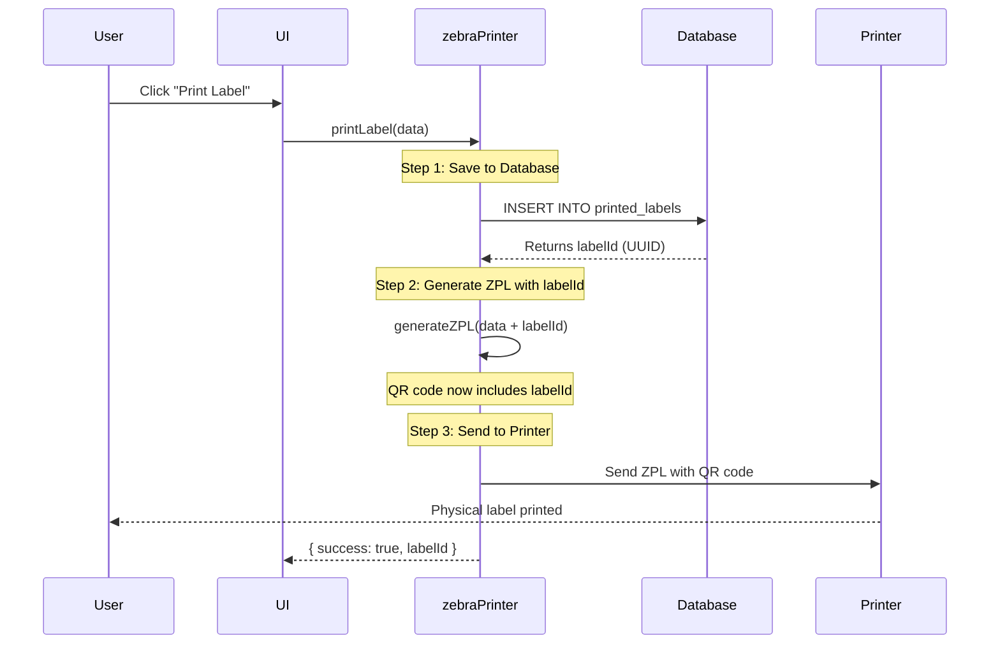
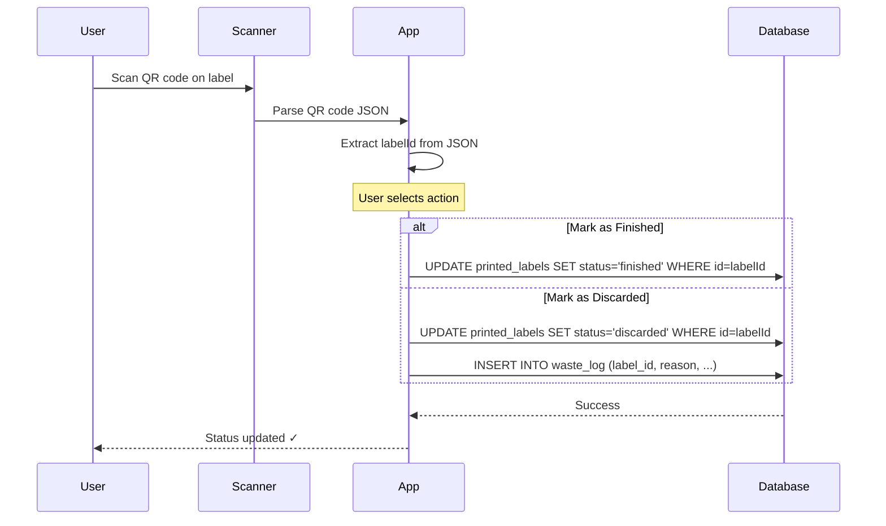

# QR Code Lifecycle Tracking Implementation

**Created:** January 5, 2026  
**Status:** ✅ Implemented  
**Purpose:** Track product lifecycle using QR codes on printed labels

---

## Overview

Every printed label includes a **QR code** that contains critical information for tracking the product through its entire lifecycle. The most important field is the **`labelId`** - a unique UUID from the `printed_labels` database table that enables scanning labels to mark them as finished, consumed, or discarded in the product lifecycle flow.

---

## QR Code Data Structure

### All Three Label Formats Include:

```json
{
  "labelId": "550e8400-e29b-41d4-a716-446655440000",  // ← CRITICAL for lifecycle tracking
  "productId": "prod_123",
  "productName": "Grilled Chicken Breast",
  "prepDate": "2026-01-05",
  "expiryDate": "2026-01-08",
  "batchNumber": "BATCH-2026-001",
  "preparedBy": "John Smith",
  "timestamp": "2026-01-05T14:30:00.000Z"
}
```

### Field Descriptions:

| Field | Type | Purpose | Required |
|-------|------|---------|----------|
| **labelId** | UUID | Links to `printed_labels.id` in database - used to mark label as finished | ✅ Critical |
| productId | string | Product identifier | ✅ Yes |
| productName | string | Human-readable product name | ✅ Yes |
| prepDate | date | Preparation date (ISO format) | ✅ Yes |
| expiryDate | date | Expiration date (ISO format) | ✅ Yes |
| batchNumber | string | Batch identifier for traceability | ✅ Yes |
| preparedBy | string | Name of person who prepared the label | ✅ Yes |
| timestamp | ISO datetime | When label was created | ✅ Yes |

---

## Implementation Details

### 1. Database Schema

**Table:** `printed_labels`

```sql
CREATE TABLE printed_labels (
  id UUID PRIMARY KEY DEFAULT gen_random_uuid(),  -- ← This is the labelId in QR code
  product_id UUID REFERENCES products(id),
  product_name TEXT NOT NULL,
  category_id UUID REFERENCES categories(id),
  category_name TEXT,
  prep_date DATE NOT NULL,
  expiry_date DATE NOT NULL,
  condition TEXT NOT NULL,
  prepared_by UUID REFERENCES auth.users(id),      -- ← Links to team member
  prepared_by_name TEXT,
  quantity TEXT,
  unit TEXT,
  allergens TEXT[],
  batch_number TEXT,
  organization_id UUID NOT NULL,
  created_at TIMESTAMP DEFAULT NOW()
);
```

### 2. Label Generation Flow



### 3. Code Implementation

#### **zebraPrinter.ts** (Zebra Thermal Printer - ZPL Format)

```typescript
export const printLabel = async (data: LabelPrintData): Promise<{ success: boolean; labelId?: string; error?: string }> => {
  try {
    // 1. Save to database first to get the labelId
    const labelId = await saveLabelToDatabase(data);

    // 2. Generate ZPL with labelId included in QR code
    const dataWithLabelId = { ...data, labelId: labelId || undefined };
    const zpl = generateZPL(dataWithLabelId);

    // 3. Send to printer
    await sendToPrinter(zpl, printQuantity);

    return { success: true, labelId };
  } catch (error) {
    return { success: false, error: error.message };
  }
};
```

**ZPL QR Code Generation:**

```typescript
const qrData = JSON.stringify({
  labelId: labelId || null,  // ← Critical field
  product: productName,
  prep: prepDate,
  exp: expiryDate,
  batch: data.batchNumber,
  by: preparedByName,
});

// ZPL command for QR code
^FO480,20^BQN,2,4^FDQA,${qrData}^FS
```

#### **pdfRenderer.ts** (PDF Export for Regular Printers)

```typescript
export async function renderPdfLabel(ctx: CanvasRenderingContext2D, data: LabelData, width: number, height: number): Promise<void> {
  // ... layout code ...
  
  // Generate QR code data - includes labelId for product lifecycle tracking
  const qrData = JSON.stringify({
    labelId: data.labelId || null, // Critical: Used to mark label as finished in lifecycle
    productId: data.productId || "",
    productName: data.productName,
    prepDate: data.prepDate,
    expiryDate: data.expiryDate,
    batchNumber: data.batchNumber,
    preparedBy: data.preparedByName,
    timestamp: new Date().toISOString(),
  });
  
  const qrDataUrl = await QRCode.toDataURL(qrData, { width: 120 });
  // Draw QR code on canvas at top right corner
}
```

#### **genericRenderer.ts** (Canvas Preview)

```typescript
export async function renderGenericLabel(ctx: CanvasRenderingContext2D, data: LabelData, width: number, height: number): Promise<void> {
  // ... layout code ...
  
  // Generate QR code data - includes labelId for product lifecycle tracking
  const qrData = JSON.stringify({
    labelId: data.labelId || null, // Critical: Used to mark label as finished in lifecycle
    productId: data.productId || "",
    productName: data.productName,
    prepDate: data.prepDate,
    expiryDate: data.expiryDate,
    batchNumber: data.batchNumber,
    preparedBy: data.preparedByName,
    timestamp: new Date().toISOString(),
  });
  
  const qrDataUrl = await QRCode.toDataURL(qrData, { width: 120 });
  // Draw QR code on canvas at top right corner
}
```

---

## Product Lifecycle Flow

### Typical Lifecycle Stages:

```
1. CREATED    → Label printed, record saved to printed_labels
                QR code contains labelId
                
2. IN USE     → Product being used in kitchen/storage
                (Optional: Scan to update status)
                
3. FINISHED   → Product consumed/used completely
                ✅ SCAN QR CODE → Mark as finished using labelId
                
4. EXPIRED    → Product passed expiry date
                System can auto-flag expired labels
                
5. DISCARDED  → Product thrown away (waste tracking)
                ✅ SCAN QR CODE → Update waste log using labelId
```

### Scanning Workflow:



---

## QR Code Specifications

### All Three Formats Use Identical QR Code Specs:

| Property | Value | Reason |
|----------|-------|--------|
| **Size** | 120x120 pixels | Easily scannable with smartphones |
| **Format** | JSON string | Easy to parse, human-readable |
| **Error Correction** | Medium (M) | Balance between size and reliability |
| **Position** | Top right corner | Consistent across all formats |
| **Margin** | 1 module | Minimal white space border |
| **Encoding** | UTF-8 | International character support |

### ZPL Command (Zebra Printers):

```zpl
^FO480,20       // Position: X=480, Y=20
^BQN,2,4        // QR code: Normal orientation, model 2, magnification 4
^FDQA,{data}    // Field data: QA mode (automatic), JSON data
^FS             // Field separator
```

### Canvas Rendering (PDF & Generic):

```typescript
const qrDataUrl = await QRCode.toDataURL(qrData, {
  width: 120,
  margin: 1,
  color: {
    dark: '#000000',  // Black modules
    light: '#FFFFFF'  // White background
  }
});

// Draw at top right
ctx.drawImage(qrImage, qrX, qrY, 120, 120);
```

---

## Usage Examples

### Example 1: Scanning Finished Product

**User Action:** Product has been used up, scan label to mark as finished

**QR Code Contains:**
```json
{
  "labelId": "abc-123-def-456",
  "productName": "Grilled Chicken",
  "expiryDate": "2026-01-08"
}
```

**App Logic:**
```typescript
async function markLabelAsFinished(qrCodeData: string) {
  const data = JSON.parse(qrCodeData);
  const labelId = data.labelId;
  
  if (!labelId) {
    throw new Error("QR code missing labelId");
  }
  
  const { error } = await supabase
    .from('printed_labels')
    .update({ 
      status: 'finished',
      finished_at: new Date().toISOString()
    })
    .eq('id', labelId);
    
  if (error) throw error;
  
  toast.success(`Label marked as finished: ${data.productName}`);
}
```

### Example 2: Waste Tracking

**User Action:** Product expired or damaged, scan to log waste

**App Logic:**
```typescript
async function logWaste(qrCodeData: string, reason: string) {
  const data = JSON.parse(qrCodeData);
  const labelId = data.labelId;
  
  // Update label status
  await supabase
    .from('printed_labels')
    .update({ 
      status: 'discarded',
      discarded_at: new Date().toISOString(),
      discard_reason: reason
    })
    .eq('id', labelId);
    
  // Log waste for reporting
  await supabase
    .from('waste_log')
    .insert({
      label_id: labelId,
      product_name: data.productName,
      reason: reason,
      expiry_date: data.expiryDate,
      organization_id: currentOrgId
    });
    
  toast.success(`Waste logged: ${data.productName}`);
}
```

### Example 3: Lifecycle Analytics

**Query:** Get all labels that are still active (not finished/discarded)

```sql
SELECT 
  id,
  product_name,
  prep_date,
  expiry_date,
  prepared_by_name,
  CASE 
    WHEN expiry_date < CURRENT_DATE THEN 'EXPIRED'
    WHEN expiry_date = CURRENT_DATE THEN 'EXPIRES TODAY'
    ELSE 'ACTIVE'
  END as lifecycle_status
FROM printed_labels
WHERE status IS NULL OR status = 'active'
ORDER BY expiry_date ASC;
```

---

## Testing Checklist

### ✅ QR Code Generation Tests

- [ ] **Zebra Printer (ZPL):**
  - [ ] Label saved to database first
  - [ ] labelId returned from database
  - [ ] ZPL generated with labelId in QR code
  - [ ] QR code scannable with smartphone
  - [ ] JSON data parsed correctly

- [ ] **PDF Renderer:**
  - [ ] QR code includes labelId
  - [ ] QR code rendered at 120x120px
  - [ ] QR code positioned top right
  - [ ] Scannable from printed PDF

- [ ] **Generic Renderer:**
  - [ ] QR code includes labelId
  - [ ] QR code rendered at 120x120px
  - [ ] QR code positioned top right
  - [ ] Visible in preview canvas

### ✅ Lifecycle Tracking Tests

- [ ] **Database Integration:**
  - [ ] printed_labels.id is UUID
  - [ ] Scan QR code → extract labelId
  - [ ] Update label status by labelId
  - [ ] Foreign key constraints respected

- [ ] **Scanning Workflow:**
  - [ ] Scan QR code with mobile device
  - [ ] Parse JSON successfully
  - [ ] Extract labelId field
  - [ ] Update database record
  - [ ] Display success message

- [ ] **Error Handling:**
  - [ ] Missing labelId → show error
  - [ ] Invalid JSON → show error
  - [ ] Label not found → show error
  - [ ] Database error → show error

---

## Future Enhancements

### Planned Features:

1. **Mobile Scanning App**
   - Dedicated mobile app for scanning labels
   - Camera integration with QR scanner
   - Offline support with sync

2. **Lifecycle Dashboard**
   - Real-time active labels count
   - Expiring soon alerts
   - Waste tracking analytics
   - Product usage patterns

3. **Automated Alerts**
   - Push notifications for expiring products
   - SMS alerts for critical items
   - Email reports for managers

4. **Advanced Analytics**
   - Product shelf life analysis
   - Waste reduction recommendations
   - Cost tracking per product
   - Compliance reporting

5. **Integration with Inventory**
   - Auto-deduct from inventory when marked finished
   - Reorder alerts based on usage
   - Stock level predictions

---

## Troubleshooting

### Problem: QR Code Missing labelId

**Symptom:** Scanning QR code shows null labelId

**Causes:**
- Label generated before database save
- Database insert failed but printing continued
- Old label format (before this update)

**Solution:**
```typescript
// Verify ZPL is generated AFTER database save
const labelId = await saveLabelToDatabase(data);
const dataWithLabelId = { ...data, labelId }; // Include labelId
const zpl = generateZPL(dataWithLabelId);
```

### Problem: QR Code Not Scanning

**Symptom:** Smartphone cannot read QR code

**Causes:**
- QR code too small (< 100px)
- Poor print quality
- Insufficient contrast
- Damaged label

**Solution:**
- Increase QR size to 120x120px minimum
- Use high-quality printer
- Ensure black & white contrast
- Reprint damaged labels

### Problem: Wrong Label Data After Scan

**Symptom:** Scanning shows incorrect product info

**Causes:**
- Old QR code format (string instead of JSON)
- Cached data in scanner
- Multiple labels printed with same QR

**Solution:**
```typescript
// Always parse as JSON
try {
  const data = JSON.parse(qrCodeData);
  if (!data.labelId) {
    throw new Error("Old format - labelId missing");
  }
} catch (error) {
  console.error("Invalid QR code format", error);
}
```

---

## Summary

### Key Points:

✅ **All three label formats include QR codes** (ZPL, PDF, Generic)  
✅ **QR codes contain `labelId`** - critical for lifecycle tracking  
✅ **Labels saved to database BEFORE printing** - ensures labelId exists  
✅ **JSON format** - easy to parse and extend  
✅ **120x120px size** - optimal for smartphone scanning  
✅ **Top right position** - consistent across all formats  

### Lifecycle Integration:

1. **Print Label** → Database record created with UUID
2. **Generate QR** → labelId included in JSON
3. **Physical Label** → QR code printed on label
4. **Scan Label** → Extract labelId from QR
5. **Update Status** → Mark as finished/discarded by labelId
6. **Analytics** → Track product lifecycle from start to finish

---

**Next Steps:**
1. Build mobile scanning interface
2. Create lifecycle status update UI
3. Implement waste tracking dashboard
4. Add automated expiry alerts
5. Build lifecycle analytics reports

**Documentation:**
- BOPP_LABEL_DESIGN.md - Label design specifications
- PREPARED_BY_REQUIRED_FIELD.md - Validation system
- LABELING_IMPLEMENTATION_COMPLETE.md - Overall implementation
