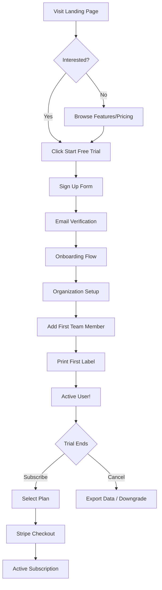

# 🎯 SPRINT 2 PROGRESS TRACKER

**Last Updated**: January 13, 2026  
**Sprint Start**: January 11, 2026  
**Sprint End**: January 31, 2026  
**Current Status**: 📊 In Progress (Day 3)

---

## ✅ COMPLETED TASKS (Sprint 2)

### Module: People & Team Management ✨
- [x] **Team Member Certificates/Documents** (January 13)
  - Document upload system (`useTeamMemberDocuments` hook)
  - Storage bucket policies configured
  - RLS policies fixed (3-layer issue resolved)
  - File preview, view, download, delete functionality
  - Integration with EditUserDialog

- [x] **TFN Formatting** (January 13)
  - Added `formatTFN()`, `getRawTFN()`, `isValidTFN()` utilities
  - Updated labels to "TFN (Tax File Number)"
  - Applied formatting across all forms

- [x] **UI Improvements** (January 13)
  - Fixed role field in EditUserDialog (removed 'owner' check)
  - Moved active switch to avoid X button conflict
  - Added Documents tab with upload functionality

### Module: Visual Identity ✨
- [x] **Orange/Black Theme** (January 13)
  - Complete CSS overhaul
  - Light mode: White + Orange
  - Dark mode: Black + Orange glow
  - Warm shadows and gradients
  - AAA accessibility (18:1 contrast)

### Module: Project Organization ✨
- [x] **Code Cleanup** (January 13)
  - Moved 40+ SQL scripts to `docs/sql-scripts/`
  - Organized documentation files
  - Created comprehensive guides

---

## 🚧 IN PROGRESS

### Module 1: People & Authentication
**Status**: 🟡 25% Complete

#### Completed:
- ✅ Team member document upload system
- ✅ TFN formatting

#### Remaining:
- [ ] **Email Invitations via Edge Function**
  - Create/update edge function for user invitations
  - Associate users with roles and departments on invite
  - Setup test credentials:
    - COOK: cooktampaapp@hotmail.com / TAMPAPP123
    - BARISTA: baristatampaapp@hotmail.com / TAMPAPP123
    - LEADER_CHEF: leadercheftampaapp@gmail.com / TAMPAAPP123
    - MANAGER: admtampaapp@hotmail.com / TAMPAAPP123

- [ ] **Team Member Profile Integration**
  - Link team members to auth profiles
  - Associate with departments during creation
  - Update team member creation flow

**Estimated Time Remaining**: 2 days

---

### Module 2: Labelling Enhancements
**Status**: 🟢 80% Complete

#### Completed:
- ✅ Zebra as default printer in production
- ✅ 5cm x 5cm label dimensions
- ✅ Organization data removed from labels
- ✅ Recipe printing integration
- ✅ Recipes in QuickPrint subcategory
- ✅ Recipe print queue support

#### Remaining:
- [ ] **Verify Printer Selector in All 3 Workflows**
  - QuickPrint flow ✅ (has printer selector)
  - Form-based label creation (verify)
  - Recipe printing ✅ (added printer selector)
  - Print queue (verify)

- [ ] **Final End-to-End Testing**
  - Test each workflow
  - Verify all requirements met

**Estimated Time Remaining**: 0.5 days

---

## 📋 NOT STARTED

### Module 3: Routine Tasks - Complete Overhaul
**Priority**: VERY HIGH  
**Status**: 🔴 0% Complete  
**Estimated Time**: 5-7 days

See detailed breakdown in original SPRINT_2_MASTER_PLAN.md

### Module 4: Feed/Communication Module
**Priority**: HIGH  
**Status**: 🔴 0% Complete  
**Estimated Time**: 4-5 days

ConnectTeam-inspired feed system - see original plan

### Module 5: Expiring Soon Enhancements
**Priority**: MEDIUM  
**Status**: 🔴 0% Complete  
**Estimated Time**: 2-3 days

QR scanner and manual expiry buttons - see original plan

---

## 🆕 NEW REQUIREMENTS (Added January 13)

### Module 6: Payment Gateway - Stripe Integration
**Priority**: HIGH  
**Status**: 🔴 0% Complete  
**Estimated Time**: 3-4 days

#### Phase 1: Stripe Setup
```typescript
// Configuration
- Stripe publishable key
- Stripe secret key (server-side only)
- Webhook endpoint
- Product SKUs
```

#### Phase 2: Subscription Plans
```typescript
interface SubscriptionPlan {
  id: string;
  name: 'Starter' | 'Professional' | 'Enterprise';
  price: number; // monthly in cents
  features: string[];
  maxUsers: number;
  maxLocations: number;
  stripePriceId: string;
}
```

#### Phase 3: Payment Flow
1. **Checkout**
   - Create Stripe Checkout session
   - Redirect to Stripe hosted page
   - Handle success/cancel callbacks

2. **Subscription Management**
   - View current plan
   - Upgrade/downgrade
   - Cancel subscription
   - Billing history

3. **Webhooks**
   - `customer.subscription.created`
   - `customer.subscription.updated`
   - `customer.subscription.deleted`
   - `invoice.payment_succeeded`
   - `invoice.payment_failed`

#### Database Schema:
```sql
CREATE TABLE subscriptions (
  id UUID PRIMARY KEY DEFAULT gen_random_uuid(),
  organization_id UUID REFERENCES organizations(id) NOT NULL,
  stripe_customer_id TEXT NOT NULL UNIQUE,
  stripe_subscription_id TEXT UNIQUE,
  plan_type TEXT CHECK (plan_type IN ('starter', 'professional', 'enterprise')),
  status TEXT CHECK (status IN ('active', 'canceled', 'past_due', 'trialing')),
  current_period_start TIMESTAMPTZ,
  current_period_end TIMESTAMPTZ,
  cancel_at_period_end BOOLEAN DEFAULT false,
  created_at TIMESTAMPTZ DEFAULT NOW(),
  updated_at TIMESTAMPTZ DEFAULT NOW()
);

CREATE TABLE billing_history (
  id UUID PRIMARY KEY DEFAULT gen_random_uuid(),
  organization_id UUID REFERENCES organizations(id) NOT NULL,
  stripe_invoice_id TEXT UNIQUE,
  amount INTEGER NOT NULL,
  currency TEXT DEFAULT 'aud',
  status TEXT NOT NULL,
  invoice_pdf TEXT,
  paid_at TIMESTAMPTZ,
  created_at TIMESTAMPTZ DEFAULT NOW()
);
```

#### Components:
- `SubscriptionPlansPage.tsx` - View/compare plans
- `CheckoutButton.tsx` - Initiate Stripe checkout
- `SubscriptionStatus.tsx` - Current plan widget
- `BillingHistory.tsx` - Invoice list
- `UpgradeDialog.tsx` - Plan upgrade flow
- `api/stripe/webhook.ts` - Handle Stripe events
- `api/stripe/create-checkout.ts` - Create session
- `api/stripe/manage-subscription.ts` - Modify subscription

**Deliverables**:
- [ ] Stripe account setup
- [ ] Payment plans configured
- [ ] Checkout flow
- [ ] Subscription management UI
- [ ] Webhook handler
- [ ] Database schema
- [ ] Testing with Stripe test mode

---

### Module 7: Landing Page & Marketing Site
**Priority**: HIGH  
**Status**: 🔴 0% Complete  
**Estimated Time**: 4-5 days

#### Structure:
```
public-site/
├── Hero Section
│   ├── Headline + CTA
│   ├── Product screenshot/demo
│   └── "Start Free Trial" button
├── Features Section
│   ├── Label Management
│   ├── Recipe Organization
│   ├── Team Collaboration
│   ├── Compliance Tracking
│   └── Real-time Updates
├── How It Works (Flow Diagram)
│   ├── 1. Sign Up
│   ├── 2. Setup Organization
│   ├── 3. Add Team Members
│   ├── 4. Start Labeling
│   └── 5. Track & Comply
├── Pricing Section
│   ├── Plan comparison table
│   ├── Feature checklist
│   └── "Choose Plan" CTAs
├── Testimonials/Social Proof
├── FAQ Section
└── Footer
    ├── Links (About, Contact, Terms, Privacy)
    ├── Social media
    └── Newsletter signup
```

#### End-to-End User Journey:


#### Components:
- `LandingPage.tsx` - Main marketing page
- `HeroSection.tsx` - Above the fold
- `FeaturesGrid.tsx` - Product features
- `HowItWorks.tsx` - Step-by-step flow
- `PricingTable.tsx` - Plan comparison
- `Testimonials.tsx` - Social proof
- `FAQ.tsx` - Common questions
- `Footer.tsx` - Site footer

#### Assets Needed:
- [ ] Product screenshots/mockups
- [ ] Feature icons
- [ ] Customer testimonials (if available)
- [ ] Brand assets (logo variations)
- [ ] Social media images

**Deliverables**:
- [ ] Landing page design
- [ ] User flow diagrams
- [ ] Feature documentation
- [ ] Pricing page
- [ ] CTA optimization
- [ ] SEO optimization
- [ ] Mobile responsive design

---

### Module 8: Knowledge Base System
**Priority**: MEDIUM  
**Status**: 🔴 0% Complete  
**Estimated Time**: 5-6 days

#### Inspiration: Operand.io

**Concept**: Transform "Drafts" into a rich Knowledge Base with TOPIC-based pages

#### Features:
1. **Topic Pages**
   - Create/edit topics
   - Rich text editor with markdown
   - Embed images, videos, documents
   - Code snippets with syntax highlighting
   - Internal linking between topics

2. **Organization**
   - Categories/collections
   - Tags system
   - Search functionality
   - Related topics suggestions
   - Breadcrumb navigation

3. **Collaboration**
   - Multiple editors
   - Version history
   - Comments/discussions
   - @mentions
   - Change tracking

4. **Access Control**
   - Public vs private topics
   - Department-specific knowledge
   - Role-based visibility
   - Guest access (read-only)

#### Database Schema:
```sql
CREATE TABLE knowledge_topics (
  id UUID PRIMARY KEY DEFAULT gen_random_uuid(),
  organization_id UUID REFERENCES organizations(id) NOT NULL,
  title TEXT NOT NULL,
  slug TEXT NOT NULL,
  content JSONB NOT NULL, -- TipTap/ProseMirror JSON
  category TEXT,
  tags TEXT[],
  visibility TEXT CHECK (visibility IN ('public', 'organization', 'department', 'private')),
  department_id UUID REFERENCES departments(id),
  created_by UUID REFERENCES team_members(id),
  updated_by UUID REFERENCES team_members(id),
  version INTEGER DEFAULT 1,
  created_at TIMESTAMPTZ DEFAULT NOW(),
  updated_at TIMESTAMPTZ DEFAULT NOW(),
  UNIQUE(organization_id, slug)
);

CREATE TABLE topic_versions (
  id UUID PRIMARY KEY DEFAULT gen_random_uuid(),
  topic_id UUID REFERENCES knowledge_topics(id) ON DELETE CASCADE,
  version INTEGER NOT NULL,
  content JSONB NOT NULL,
  changed_by UUID REFERENCES team_members(id),
  change_summary TEXT,
  created_at TIMESTAMPTZ DEFAULT NOW()
);

CREATE TABLE topic_comments (
  id UUID PRIMARY KEY DEFAULT gen_random_uuid(),
  topic_id UUID REFERENCES knowledge_topics(id) ON DELETE CASCADE,
  author_id UUID REFERENCES team_members(id),
  content TEXT NOT NULL,
  parent_id UUID REFERENCES topic_comments(id), -- For threading
  created_at TIMESTAMPTZ DEFAULT NOW()
);

CREATE TABLE topic_links (
  id UUID PRIMARY KEY DEFAULT gen_random_uuid(),
  from_topic_id UUID REFERENCES knowledge_topics(id) ON DELETE CASCADE,
  to_topic_id UUID REFERENCES knowledge_topics(id) ON DELETE CASCADE,
  created_at TIMESTAMPTZ DEFAULT NOW(),
  UNIQUE(from_topic_id, to_topic_id)
);
```

#### Components:
- `KnowledgeBasePage.tsx` - Main hub
- `TopicEditor.tsx` - Rich text editor (TipTap)
- `TopicViewer.tsx` - Rendered topic view
- `TopicSearch.tsx` - Search with filters
- `TopicCategories.tsx` - Category browser
- `TopicComments.tsx` - Discussion thread
- `TopicVersionHistory.tsx` - Version compare
- `RelatedTopics.tsx` - Suggestions sidebar

#### Features:
- [ ] Rich text editor (TipTap/ProseMirror)
- [ ] Markdown support
- [ ] Image upload and embedding
- [ ] Code syntax highlighting
- [ ] Internal topic linking
- [ ] Full-text search (PostgreSQL FTS)
- [ ] Version control
- [ ] Comments system
- [ ] Tag management
- [ ] Category organization
- [ ] Export to PDF
- [ ] Print-friendly view

**Deliverables**:
- [ ] Database schema
- [ ] Topic CRUD operations
- [ ] Rich text editor integration
- [ ] Search functionality
- [ ] Version history
- [ ] Access control
- [ ] UI/UX design
- [ ] Mobile optimization

---

### Module 9: Training Modules & User Guides
**Priority**: MEDIUM  
**Status**: 🔴 0% Complete  
**Estimated Time**: 4-5 days

#### Purpose:
Provide downloadable training materials and interactive guides for users

#### Structure:
```
Training Center/
├── Getting Started Guide (PDF)
├── Video Tutorials
│   ├── Creating Your First Label
│   ├── Managing Team Members
│   ├── Recipe Organization
│   ├── Using Routine Tasks
│   └── Compliance Reports
├── Interactive Walkthroughs (in-app)
│   ├── First-time user onboarding
│   ├── Feature discovery
│   └── Best practices
├── Downloadable Resources
│   ├── Label Design Templates
│   ├── Compliance Checklists
│   ├── Recipe Templates
│   └── Quick Reference Cards
└── FAQ & Troubleshooting
```

#### Components:
- `TrainingCenter.tsx` - Training hub
- `VideoLibrary.tsx` - Tutorial videos
- `DownloadableGuides.tsx` - PDF downloads
- `InteractiveTutorial.tsx` - Step-by-step walkthrough
- `QuickStartGuide.tsx` - First-use guide

#### Content to Create:
1. **PDF Guides** (Downloadable)
   - [ ] Getting Started Guide (20-30 pages)
   - [ ] Label Management Guide
   - [ ] Team Collaboration Guide
   - [ ] Compliance & Safety Guide
   - [ ] Admin Manual
   - [ ] Quick Reference Card

2. **Video Tutorials** (Screen recordings)
   - [ ] Creating Your First Label (5 min)
   - [ ] Managing Team Members (7 min)
   - [ ] Recipe Organization (10 min)
   - [ ] Using Routine Tasks (8 min)
   - [ ] Running Compliance Reports (6 min)

3. **Interactive Walkthroughs** (In-app)
   - [ ] First login onboarding
   - [ ] Feature discovery tooltips
   - [ ] Contextual help bubbles

**Deliverables**:
- [ ] Training center page
- [ ] PDF guide authoring
- [ ] Video recording/editing
- [ ] Interactive tutorial system
- [ ] Download tracking
- [ ] Feedback collection

---

### Module 10: SMTP Configuration for Production
**Priority**: HIGH (Pre-deployment)  
**Status**: 🔴 0% Complete  
**Estimated Time**: 1-2 days

#### Requirements:
When deploying to Vercel, update SMTP settings from development to production

#### Current Setup (Development):
```
SMTP Host: smtp.resend.com (or similar)
From Address: dev@tampaapp.com
Test emails only
```

#### Production Setup:
```
SMTP Host: [Production SMTP Server]
From Address: noreply@tampaapp.com
Domain: tampaapp.com
DKIM: Configured
SPF: Configured
DMARC: Configured
```

#### Environment Variables:
```bash
# Vercel Production Environment
SMTP_HOST=smtp.production.com
SMTP_PORT=587
SMTP_USER=noreply@tampaapp.com
SMTP_PASSWORD=<secure-password>
SMTP_FROM=Tampa APP <noreply@tampaapp.com>
SMTP_TLS=true
```

#### Email Types:
- User invitation emails
- Password reset
- Team member notifications
- System alerts
- Billing notifications
- Weekly summary reports

#### Tasks:
- [ ] Choose production SMTP provider (SendGrid, AWS SES, Postmark)
- [ ] Configure DNS records (SPF, DKIM, DMARC)
- [ ] Set up email templates
- [ ] Configure Vercel environment variables
- [ ] Test email delivery
- [ ] Monitor bounce rates
- [ ] Setup email analytics

**Deliverables**:
- [ ] SMTP provider account
- [ ] DNS records configured
- [ ] Environment variables set
- [ ] Email templates designed
- [ ] Delivery testing complete
- [ ] Monitoring dashboard

---

## 📊 UPDATED SPRINT 2 TIMELINE

### Week 1 (Jan 11-17) - CURRENT WEEK
- ✅ **Day 1-3**: People module (documents, TFN) ✨
- ✅ **Day 3**: Visual identity overhaul ✨
- 🚧 **Day 4-5**: Email invitations + labelling verification

### Week 2 (Jan 18-24)
- **Day 6-8**: Routine Tasks overhaul (Phase 1 & 2)
- **Day 9-10**: Feed Module (Phase 1)
- **Day 11**: Landing page structure

### Week 3 (Jan 25-31)
- **Day 12**: Feed Module (Phase 2)
- **Day 13-14**: Stripe integration
- **Day 15**: Expiring Soon enhancements
- **Day 16**: Knowledge Base foundation
- **Day 17**: Testing & bug fixes

---

## 🎯 SPRINT 3 PREVIEW (Feb 1-14)

### Primary Focus:
- Complete Knowledge Base system
- Training modules & guides
- Onboarding flow
- Video tutorials
- Multi-location support (if time permits)

### Pre-deployment:
- SMTP production configuration
- Stripe live mode
- Landing page polish
- Performance optimization
- Security audit

---

## 📈 METRICS & KPIS

### Sprint 2 Goals:
- ✅ 25% Complete (3/12 major modules)
- 🎯 Target: 80% by January 31
- 📊 Current Velocity: Strong (3 days, 3 modules done)

### Technical Debt:
- Storage bucket policies (resolved ✅)
- RLS complexity (documented ✅)
- Email invite system (pending)
- Routine tasks overhaul (planned)

---

## 🚀 NEXT IMMEDIATE ACTIONS (Day 4 - January 14)

### Priority 1: Email Invitations
1. Create edge function for user invites
2. Setup test email accounts
3. Test invitation flow

### Priority 2: Labelling Verification
1. Test printer selector in all workflows
2. Document any issues
3. Create fix tickets if needed

### Priority 3: Planning
1. Finalize Stripe integration approach
2. Review landing page wireframes
3. Knowledge Base structure design

---

## 📚 DOCUMENTATION STATUS

### Completed:
- ✅ Storage policies guide
- ✅ Visual identity documentation
- ✅ RLS troubleshooting guides
- ✅ Day summaries
- ✅ Sprint 2 master plan

### Needed:
- [ ] Stripe integration guide
- [ ] Landing page specifications
- [ ] Knowledge Base design doc
- [ ] Training module structure
- [ ] End-to-end user journey maps
- [ ] API documentation
- [ ] Deployment checklist

---

**Last Updated**: January 13, 2026, 4:00 AM  
**Next Review**: January 14, 2026  
**Sprint Health**: 🟢 Excellent Progress
